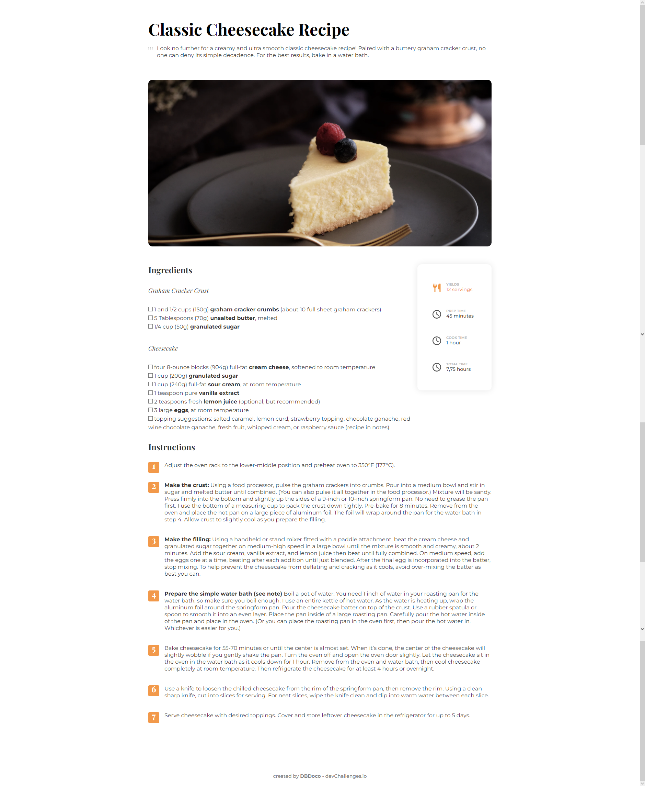

<h1 align="center">Recipe page</h1>

   Solution for a challenge from  <a href="http://devchallenges.io" target="_blank">Devchallenges.io</a>.

  <h3>
    <a href="https://{your-demo-link.your-domain}">
      Demo
    </a>
     | 
    <a href="https://{your-url-to-the-solution}">
      Solution
    </a>
     | 
    <a href="https://devchallenges.io/challenges/OEKdUZ6xs0h99C38XVht">
      Challenge
    </a>
  </h3>

<!-- TABLE OF CONTENTS -->

## Table of Contents

- [Overview](#overview)
- [Built With](#built-with)
- [Features](#features)

<!-- OVERVIEW -->

## Overview

### Built With

Html and Css.

## Features

- [x] User story: I can see a recipe with ingredients and instructions
- [x] User story: I can select a checkbox if I have the ingredients
- [x] User story: I can see the number of servings, baking times

This application/site was created as a submission to a [DevChallenges](https://devchallenges.io/challenges) challenge. The [challenge](https://devchallenges.io/challenges/OEKdUZ6xs0h99C38XVht) was to build an application to complete the given user stories.